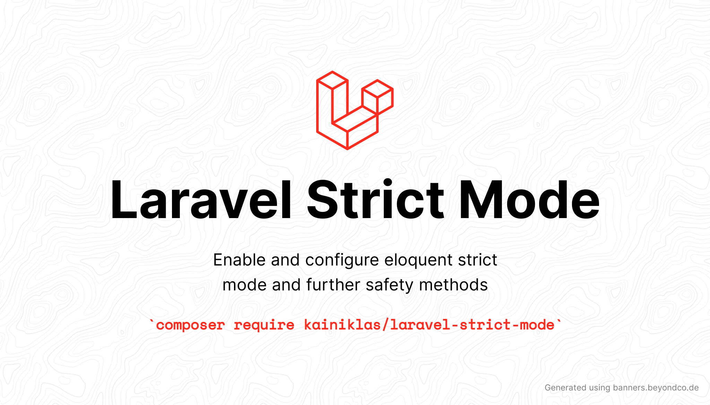

# Laravel Package to Enable Eloquent "Strict Mode" and Further Safety Methods



[](https://packagist.org/packages/kainiklas/laravel-strict-mode)
[](https://github.com/kainiklas/laravel-strict-mode/actions?query=workflow%3Arun-tests+branch%3Amain)
[](https://github.com/kainiklas/laravel-strict-mode/actions?query=workflow%3A"Fix+PHP+code+style+issues"+branch%3Amain)
[](https://packagist.org/packages/kainiklas/laravel-strict-mode)

Enables the following configurable eloquent "strict mode" features:

- Prevent Lazy Loading (N+1)
    - Non-production: Throws an `Illuminate\Database\LazyLoadingViolationException` exception
    - Production: Writes a warning into the logs
- Prevent defaulting to NULL when using a model's attribute that hasn't been fetched from the DB or doesn't exist on the model
    - Throws an `Illuminate\Database\Eloquent\MissingAttributeException` exception (all environments)
- Prevent loosing attributes when creating or updating models because of missing attributes in the $fillable array
    - Throws an `Illuminate\Database\Eloquent\MassAssignmentException` exception (all environments)

Enables the following configurable safety methods:

- Long-running command monitoring
    - Writes a warning into the logs including the command name, user and duration which took longer than the specified threshold (default: 5000ms)
- Long-running requests monitoring
    - Writes a warning into the logs including the request url, user and duration which took longer than the specified threshold (default: 5000ms)
- Long-running single DB query monitoring
    - Writes an info into the logs including the SQL query and duration which took longer than the specified threshold (default: 1000ms)
- Long-running DB connection monitoring
    - Writes an info into the logs including the DB connection name which took longer than the specified threshold (default: 2000ms)


## Installation

**Laravel Version ^9.35 required.**

You can install the package via composer:

```bash
composer require kainiklas/laravel-strict-mode
```

Optionally, you can publish the config file. 

```bash
php artisan vendor:publish --tag="laravel-strict-mode-config"
```

Alternatively, you can use environment variables to influence the behaviour.

This is the contents of the published config file. 

```php
return [

    /**
     * Throw exception if model is lazy loaded.
     * Exception is only thrown if log_lazy_loading is set to false.
     */
    'prevent_lazy_loading' => env(
        'PREVENT_LAZY_LOADING',
        true,
    ),

    /**
     * Lazy Loading violation is logged. No exception is thrown.
     * Only works, if prevent_lazy_loading is set to true.
     */
    'log_lazy_loading' => env(
        'LOG_LAZY_LOADING',
        env('APP_ENV') == 'production'
    ),

    /**
     * Prevent non-fillable attributes from being silently discarded.
     * Instead, throw an Illuminate\Database\Eloquent\MassAssignmentException.
     *
     * correctness of app -> should be enabled in all environments
     */
    'prevent_silently_discarding_attributes' => env(
        'PREVENT_SILENTLY_DISCARDING_ATTRIBUTES',
        true
    ),

    /**
     * If activated an Illuminate\Database\Eloquent\MissingAttributeException
     * is thrown whenever an attribute is accessed which is not present in the model,
     * instead of falling back to NULL.
     *
     * correctness of app -> should be enabled in all environments
     */
    'prevent_accessing_missing_attributes' => env(
        'PREVENT_ACCESSING_MISSING_ATTRIBUTES',
        true
    ),

    /**
     * Logs a warning if a command runs longer than the specified threshold.
     * Threshold is speficied in milliseconds [ms].
     */
    'long_running_command_threshold' => env(
        'LONG_RUNNING_COMMAND_THRESHOLD',
        5000 // [ms]
    ),

    /**
     * Logs a warning if a HTTP request runs longer than the specified threshold.
     * Threshold is speficied in milliseconds [ms].
     */
    'long_running_request_threshold' => env(
        'LONG_RUNNING_REQUEST_THRESHOLD',
        5000 // [ms]
    ),

    /**
     * Logs a warning if a DB connection runs longer than the specified threshold.
     * Threshold is speficied in milliseconds [ms].
     */
    'long_running_total_db_query_threshold' => env(
        'LONG_RUNNING_TOTAL_DB_QUERY_THRESHOLD',
        2000 // [ms]
    ),

    /**
     * Logs a warning if a single DB Query runs longer than the specified threshold.
     * Threshold is speficied in milliseconds [ms].
     */
    'long_running_single_db_query_threshold' => env(
        'LONG_RUNNING_SINGLE_DB_QUERY_THRESHOLD',
        1000 // [ms]
    ),

];
```


## Testing

```bash
composer test
```

## Changelog

Please see [CHANGELOG](CHANGELOG.md) for more information on what has changed recently.

## Contributing

Please see [CONTRIBUTING](CONTRIBUTING.md) for details.

## Security Vulnerabilities

Please review [our security policy](../../security/policy) on how to report security vulnerabilities.

## Acknowledgements

This package is based on the the article:
- [Laravel's safety mechanisms](https://planetscale.com/blog/laravels-safety-mechanisms#model-strictness) by [Aaron Francis](https://github.com/aarondfrancis)

## Credits

- [Kai Niklas](https://github.com/kainiklas)
- [All Contributors](../../contributors)

## License

The MIT License (MIT). Please see [License File](LICENSE.md) for more information.
